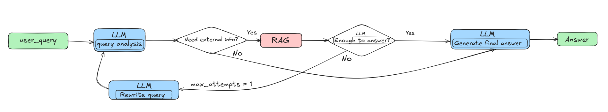
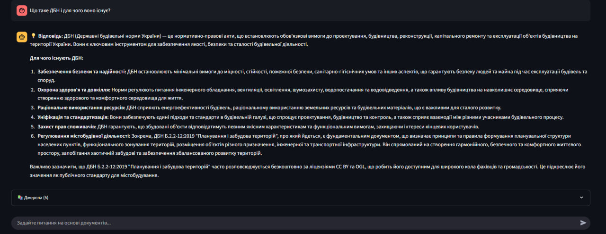

# 🤖 Agentic RAG Application

A production-ready Retrieval-Augmented Generation (RAG) system with agent capabilities, built with FastAPI and LangChain.
## Current pipeline

## 📋 Features

- **Vector Memory Management**: Store and search documents using semantic embeddings
- **Agentic RAG**: Intelligent question-answering with context retrieval
- **Multiple Document Sources**: Support for file uploads and URL ingestion
- **Advanced Search**: Bi-encoder + cross-encoder reranking
- **Conversation Memory**: Stateful agent interactions
- **Docker Support**: Easy deployment with Docker Compose

---

## 🚀 Quick Start

### 1️⃣ Clone Repository

```bash
git clone <your-repo-url>
cd rag_app
```

### 2️⃣ Install Dependencies

**Option A: Using pip (local development)**
```bash
pip install --upgrade pip
pip install -r requirements.txt
```

**Tip:** Regenerate requirements.txt from your venv:
```bash
pip freeze > requirements.txt
```

### 3️⃣ Configure Environment

Create your `.env` file:
```bash
cp .env.example .env
```

Fill in your API keys and model configurations:
```env
LLM_API_KEY=your_llm_api_key_here
EMBEDDING_MODEL=your_embedding_model
RERANK_MODEL=your_rerank_model
SUMMARIZATION_MODEL=your_summarization_model
```

### 4️⃣ Run with Docker

```bash
docker-compose up --build
```

**Access the application:**
- 📚 **FastAPI Docs**: http://localhost:8000/docs
- 🎨 **Streamlit UI**: http://localhost:8501

**Rebuild without cache (if needed):**
```bash
docker-compose build --no-cache
docker-compose up
```

---

# 📖 Документація API системи RAG

Цей документ містить опис доступних ендпоінтів для взаємодії з агентом та векторною пам'яттю.

---

## 🤖 Роутер: Agent (`/agent`)
Використовується для інтелектуального спілкування з асистентом, який має доступ до бази знань.

### 1. Чат з агентом
* **URL:** `/agent/chat`
* **Метод:** `POST`
* **Тіло запиту:** `RAGQueryRequest`
* **Опис:** Відправляє запит до RAG-агента. Агент може перефразувати питання для кращого пошуку та повертає відповідь разом із посиланнями на джерела.

---

## 🧠 Роутер: Vector Memory (`/vector-memory`)
Керування документами, їх індексація та семантичний пошук.

### 📥 Додавання контенту
| Метод | Шлях | Опис |
| :--- | :--- | :--- |
| `POST` | `/documents/file` | Завантаження файлу (`.pdf`, `.docx`, `.txt`, `.md`, `.html`). Обробка у фоні. |
| `POST` | `/documents/url` | Індексація контенту за прямим посиланням. |

### 🔍 Пошук та статус
| Метод | Шлях | Опис |
| :--- | :--- | :--- |
| `POST` | `/search` | Повнотекстовий та семантичний пошук у векторній базі. |
| `GET` | `/status` | Отримання статистики сховища (кількість документів тощо). |

### 🗑️ Видалення
| Метод | Шлях | Опис |
| :--- | :--- | :--- |
| `DELETE` | `/delete` | Видалення конкретних документів за фільтром метаданих. |
| `DELETE` | `/clear` | Повне очищення всієї векторної бази. |

---
---

## 🏗️ Architecture

### Components

- **Vector Memory**: Manages document storage with ChromaDB
- **Embedders**: 
  - `HFBiEmbedder`: Bi-encoder for fast retrieval
  - `HFCrossEncoder`: Cross-encoder for precise reranking
- **Document Parser**: `DBNParser` handles multiple file formats
- **RAG Agent**: Stateful agent with conversation memory
---

## 🛠️ Development

### Run Locally (without Docker)

```bash
# Install dependencies
pip install -r requirements.txt

# Run FastAPI server
uvicorn app.main:app --reload --host 0.0.0.0 --port 8000

# Run Streamlit (in another terminal)
streamlit run streamlit_app.py
```

---

## 📝 Supported File Formats

- PDF documents
- Word documents (.docx)
- Web pages (via URL)

---

## Example

